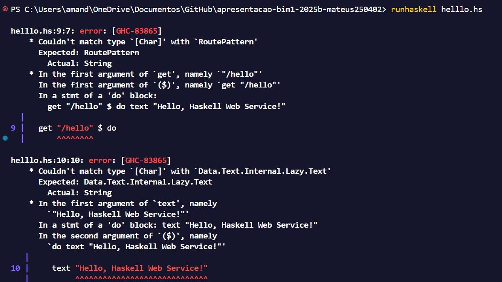

# apresentacao-bim1-2025b-mateus250402
apresentacao-bim1-2025b-mateus250402 created by GitHub Classroom

# Parte teórica

### Análise de randomAdviceService.hs
```haskell
advices :: [Text]
advices =
    [ "It always seems impossible, until it's done."
    , "To cleanly remove the seed from an Avocado, lay a knife firmly across it, and twist."
    , "Fail. Fail again. Fail better."
    , "Play is the true mother of invention."
    , "Remedy tickly coughs with a drink of honey, lemon and water as hot as you can take."
    ]

getRandomAdvice :: IO Text
getRandomAdvice = do
    index <- randomRIO (0, length advices - 1)
    return $ advices !! index

main :: IO ()
main = scotty 3000 $ do
    middleware logStdoutDev
    get "/advice" $ do
        randomAdvice <- liftIO getRandomAdvice   
        text randomAdvice
```
A definição de **advices** e **getRandomAdvice** é familiar. Primeiro há o que parece ser a definição de uma variável global **advices**, sendo uma coleção de conselhos; **getRandomAdvice** parece utilizar a função randomRIO para gerar um número aleatório entre 0 e o tamanho do vetor - 1, retornando o elemento naquele índice.  
Já na **main** foi possível identificar o uso de **$** para suprimir **()**, acredito que **scotty 3000** possa ser a porta de um servidor (?), **liftIO** e **text** acredito que seja algo para exibir como texto em uma interface web.

### Análise de randomAdviceServiceJson.hs
```haskell
advices =
    [ "It always seems impossible, until it's done."
    , "To cleanly remove the seed from an Avocado, lay a knife firmly across it, and twist."
    , "Fail. Fail again. Fail better."
    , "Play is the true mother of invention."
    , "Remedy tickly coughs with a drink of honey, lemon and water as hot as you can take."
    ]

getRandomAdvice :: IO Text
getRandomAdvice = do
    index <- randomRIO (0, length advices - 1)

    let advice = advices !! index
        responseString = "{\"advice\": \"" ++ unpack advice ++ "\"}"
        responseText = pack responseString
    return responseText

main :: IO ()
main = scotty 3000 $ do
    middleware logStdoutDev
    get "/advice" $ do
        randomAdvice <- liftIO getRandomAdvice
        setHeader "Content-Type" "application/json"
        text randomAdvice
```
Nesse arquivo consigo observar uma diferença no formato enviada para web, enviando o conselho formatado como **json** para ser o **header** da página, a formatação utiliza o conhecido **++** para concatenar string nesse caso.

### Análise de poiService.hs
```haskell
poiList :: [(String, Double, Double)]
poiList = [("Centro de Tecnologia", -29.713318, -53.71663),
           ("Biblioteca Central", -29.71566, -53.71523),
           ("Centro de Convenções", -29.72237, -53.71718),
           ("Planetário", -29.72027, -53.71726),
           ("Reitoria da UFSM", -29.72083, -53.71479),
           ("Restaurante Universitário 2", -29.71400, -53.71937),
           ("HUSM", -29.71368, -53.71536),
           ("Pulsar Incubadora Tecnológica - Prédio 2", -29.71101, -53.71634),
           ("Pulsar Incubadora Tecnológica - Prédio 61H", -29.72468, -53.71335),
           ("Casa do Estudante Universitário - CEU II", -29.71801, -53.71465)]

poiJsonFormat :: String
poiJsonFormat = "{\"poi\": \"%s\", \"latitude\": \"%s\", \"longitude\": \"%s\"}"

poiToJSONString :: (String, Double, Double) -> String
poiToJSONString (poi,lat,lon) = printf poiJsonFormat poi (show lat) (show lon)

poiListToJSONString :: [(String, Double, Double)] -> String
poiListToJSONString poiList = "[" ++  (intercalate "," $ map poiToJSONString poiList) ++ "]"

calcDistance :: Double -> Double -> Double -> Double -> Double
calcDistance lat1 lon1 lat2 lon2 = 
    let r = 6371.0 -- Earth's radius in km
        dLat = (lat2 - lat1) * pi / 180.0
        dLon = (lon2 - lon1) * pi / 180.0
        a = sin (dLat / 2.0) * sin (dLat / 2.0) +
            cos (lat1 * pi / 180.0) * cos (lat2 * pi / 180.0) *
            sin (dLon / 2.0) * sin (dLon / 2.0)
        c = 2.0 * atan2 (sqrt a) (sqrt (1.0 - a))
    in r * c

main :: IO ()
main = scotty 3000 $ do
    middleware logStdoutDev  -- Log requests for development

    -- Route to return a hardcoded, sample POI
    get "/poi" $ do
        -- We set the header manually because we are returning a text (manually formatted as json)
        setHeader "Content-Type" "application/json"
        let response = poiToJSONString ("Restaurante Universitário 2", -29.71400, -53.71937)
        text (pack response)

    -- Route to return the POI list in JSON format
    get "/poilist" $ do
        setHeader "Content-Type" "application/json"
        let response = poiListToJSONString poiList
        text (pack response)    

    -- For example: http://localhost:3000/near/-29.71689/-53.72968
    get "/near/:lat/:lon" $ do
        setHeader "Content-Type" "application/json"
        givenLat <- pathParam "lat" :: ActionM Double
        givenLon <- pathParam "lon" :: ActionM Double
        let nearDistance = 1.5::Double
            near = filter isNear poiList
                where
                    distance (_, poiLat, poiLon) = calcDistance givenLat givenLon poiLat poiLon
                    isNear poi = distance poi <= nearDistance
            response = poiListToJSONString near
        text (pack response)
```
Esse código mostra-se similar ao visto em apresentação anterior, calculando a **distância** de um **ponto de interesse** até algumas localizações da UFSM, porém nessa versão o conteúdo é formatado para **JSON** utilizando também de **++** para concatenar string. Na **main** o código parece gerar uma rota na web para exibir os dados de distância especificamente do ponto de interesse para os demais pontos.

### Análise código Isadora
```haskell
data Lyric = Lyric {
      idLyric :: Int
    , verse :: String
    , song  :: String
    }deriving(Show, Generic)
```
Nesse trecho acredito ser algo similar ao **struct** do **C**, porém não tenho total certeza, para uma letra de música, tendo id, verso e a qual música pertence.
```haskell
checkAnswer :: String -> Int -> [Lyric] -> Bool
checkAnswer userAnswer idL lyrics = (map toLower userAnswer) == map toLower (song ((getAnswer lyrics idL)!!0))
```
Acredito que essa função compara a resposta do usuário convertida totalmente para letras minúsculas com a resposta real também em minúsculo.

```haskell
parseLyrics :: String -> [Lyric]
parseLyrics fileContents = do
  [id', verse', song'] <- splitOn "|" <$> lines fileContents
  Just id'' <- return (readMaybe id')
  return (Lyric {idLyric = id'', verse = verse', song = "*"})

parseAnswers :: String -> [Lyric]
parseAnswers fileContents = do
  [id', verse', song'] <- splitOn "|" <$> lines fileContents
  Just id'' <- return (readMaybe id')
  return (Lyric {idLyric = id'', verse = verse', song = song'})
```
Acredito que estejam "quebrando" a letra da música e a resposta do usuário em chaves para acessar o conteúdo, apenas com a diferença de que a primeira atribui **"*"** para **song** e a segunda atribui um valor **song'** para o mesmo.

# Parte prática
Primeiramente tentei executar o código abaixo:
```haskell
import Web.Scotty
import Network.Wai.Middleware.RequestLogger (logStdoutDev)

main :: IO ()
main = scotty 3000 $ do
  middleware logStdoutDev

  get "/hello" $ do
    text "Testando Scooty Haskell"
```
Porém esse execução gerou 2 erros:

Após consultar descobir que a origem do primeiro erro foi que o tipo de **get** deveria ser **RoutePattern** e não uma string, resolvendo isso de modo que habilita string para ser interpretada como outros tipos derivados.
```haskell
{-# LANGUAGE OverloadedStrings #-}
```
O segundo erro ocorreu também por um erro de definição de tipo, pois a função esperava o tipo **Data.Text.Lazy.Text** e estava usando string, resolvendo do seguinte modo:
```haskell
text (pack "Testando Scooty Haskell")
```
Por fim, o código completo foi executado com sucesso
```haskell
{-# LANGUAGE OverloadedStrings #-}

import Web.Scotty
import Network.Wai.Middleware.RequestLogger (logStdoutDev)
import Data.Text.Lazy (pack) 

main :: IO ()
main = scotty 3000 $ do
  middleware logStdoutDev

  get "/hello" $ do
    text (pack "Testando Scooty Haskell") 
```
